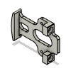
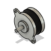
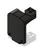
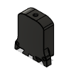
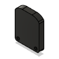
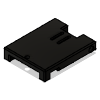

# printer-mods BOM
|Image|Part Number|Quantity|Description|
|-|-|-|-|
||Twist-Ins|1||
||Helping Hands 100|1||
||Helping Hands 150|1||
||Helping Hands 200|1||
||HSI M3x5x4|14||
||Clockwork v1 Block|1||
||Filament|1||
||Shaft 2x7|4||
||Lever|2||
||Bearing 10x4x2|4||
||Spring 10x4.6|4||
||Bearing 7x2.45x5|8||
||Drive Shaft|4||
||Drive Gear - 16 teeth|2||
||Stepper|2||
||steamroller-cw-v1-rear|1||
||steamroller-cw-v1-front|1||
||steamroller-cw-v1-mid|1||
||KW10 Microswitch|1||
||M3 Hammerhead T-Nut|1||
||M3x8 SHCS|1||
||M2x10 SHCS|2||
||M2 Nut|2||
||filament-runout-sensor|1||
||5lb Spool Holder|1||
||Bowden Merger|1||
