# Enclosed Assembly - 300x300x300 BOM

|Image|Name|Number|Quantity|Description|
|-|-|-|-|-|
||3030_end_cap v1:1|3030_end_cap|3||
|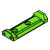|3030_spool_holder v1:1|3030_spool_holder|1||
|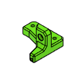|3030_spool_holder_guide v1:1|3030_spool_holder_guide|1||
|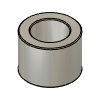|Aluminium Spacer - 6mm v1:1|HW1018NC|15||
|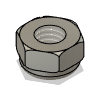|Hex Locking Nut - M5 v1:1|HW1039NC|16||
|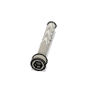|Cap Head Screw M5x35 v1:1|HW1060SC|6||
|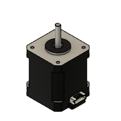|Nema 17 Stepper Motor - 48mm - 1.8degree/step, 76oz-in v1:1|HW1078EC|5||
|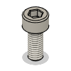|Cap Head Screw M5x12 v1:1|HW1202SC|2||
|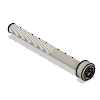|Cap Head Screw M3x30 v1:1|HW1227SK|2||
|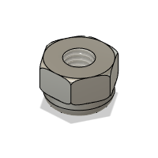|Hex Locking Nut - M3 v1:1|HW1251NC|24||
|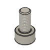|Cap Head Screw M5x10 v1:1|HW1285SC|6||
|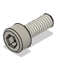|Cap Head Screw M4x10 v1:1|HW1288SC|8||
|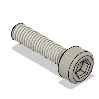|Cap Head Screw M3x12 v1:1|HW1292SC|78||
|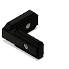|Inside Hidden Corner Bracket - for 3030 v1:1|HW1305BC|4||
|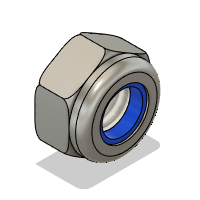|Hex Locking Nut - M6 v1:1|HW1311NC|8||
|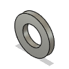|Washer Simple M6 v1:1|HW1314NC|134||
|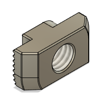|T-Nut - Drop In for 3030 - M6 v1:1|HW1361NC|364||
|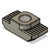|T-Nut - Drop In for 3030 - M5 v1:1|HW1383NC|5||
||Cap Head Screw M3x8 v1:1|HW1502SC|26||
|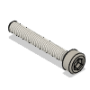|Cap Head Screw M3x20 v1:1|HW1504SC|12||
|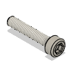|Cap Head Screw M3x16 v1:1|HW1507SC|16||
|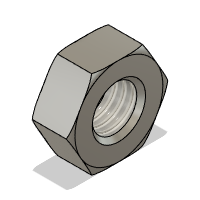|Hex Nut - M3 v1:1|HW1508NC|2||
|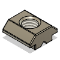|T-Nut - Square type for 2020 - M5 v1:1|HW1522NC|6||
|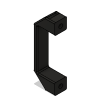|V-Slot Door Handle v1:1|HW1555GC|3||
|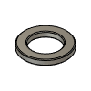|Mini Precision Shim - 8x5x1mm v1:1|HW1630NC|24||
|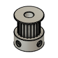|Timing Pulley - 2GT (2mm) - 20 Tooth - For 9mm Belt - 5mm Bo v1:1|HW1654WC|2||
||T-Nut - Drop In for 2020 - M3 v1:1|HW1665NC|16||
|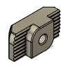|T-Nut - Drop In for 3030 - M3 v1:1|HW1821NC|78||
|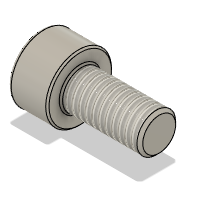|Cap Head Screw M6x12 v1:1|HW1836SC|326||
|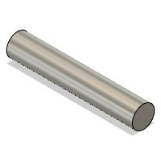|Hinge - Black thermoplastic - for 3030 - 45mm Length:1|HW1848GC|3||
|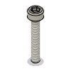|Cap Head Screw M3x18 v1:1|HW1866SC|12||
|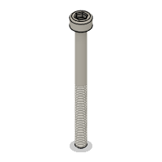|Cap Head Screw M3x35 v1:1|HW1868SC|8||
||Cap Head Screw M6x20 v1:1|HW1870SC|10||
||FlexPlate Set - Powder coated PEI 310x310mm v1:1|HW1895GC|1||
|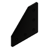|Joining Plate for 3030 - 90 Degree - Black Anodized v1:1|HW1915PC|34||
||Cast 90 Degree Corner Bracket for 3030 - 6 Slot - Black v1:1|HW1916BC|18||
|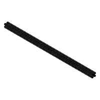|V-Slot 2020 - Black - 422mm v1:1|HW201BRC|1||
|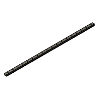|Linear Rail - MGN12 400mm + MGN12C carriage v1:1|HW2036GC|4||
|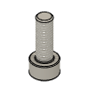|Cap Head Screw M5x14 v1:1|HW2116SC|3||
|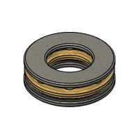|Thrust Bearing F8-16M v1:1|HW2118WC|3||
|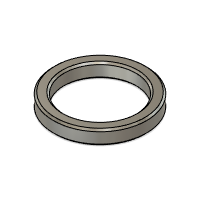|Mini Precision Shim - 6.5x5x1mm v1:1|HW2120WC|4||
|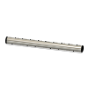|Dowel Pin - 3x35mm v1:1|HW2126GC|6||
|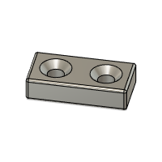|Magnet - 20x10x5mm - Two hole (M3 Countersink screws) v1:1|HW2127GC|3||
|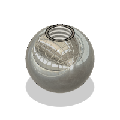|Steel Ball - 12mm - Threaded M5 v1:1|HW2128GC|3||
|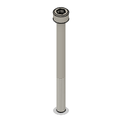|Cap Head Screw M5x60 v1:1|HW2136SC|4||
|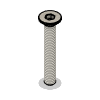|Countersink Screw M3x20 v1:1|HW2137SC|6||
|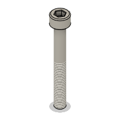|Cap Head Screw M5x40 v1:1|HW2138SC|6||
|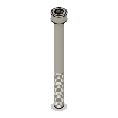|Cap Head Screw M5x55 v1:1|HW2140SC|4||
|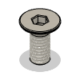|Countersink Screw M6x14 v1:1|HW2173SC|30||
|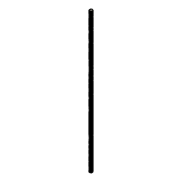|Lead Screw - TR8*4 Metric Acme Lead Screw - 380mm v1:1|HW2191SC|3||
|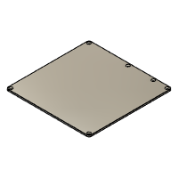|Bed Plate - Cast tooling plate - Pre-Machined - 329*329*6mm v1:1|HW2198PC|1||
|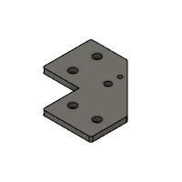|idler_plate_v1.0 v1:1|HW2201PC|2||
|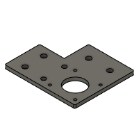|motor_plate_v1.0 v1:1|HW2202PC|2||
|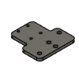|xy_joiner_plate_v1.0 v1:1|HW2203PC|2||
|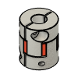|Coupler - Spider/Jaw Type - 5mm*8mm v1:1|HW2204GC|3||
||TR8*4 Anti-Backlash Nut Block v1:1|HW2205GC|3||
|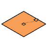|Keenovo 280x280 600W Silicone Heater Pad v1:1|HW2346EK|1||
||Countersink Screw M5x16 v1:1|HW2349SC|3||
||Linear Rail - MGN12 350mm + MGN12C carriage v1:1|HW2353GC|2||
||Gas Strut 10KG (100N) - Black:1|HW2771GC|2||
||Countersink Screw M8x12 v1:1|HW2772SC|4||
||T-Nut - Drop In for 3030 - M4 v1:1|HW2774NC|8||
||Idler Pulley - Smooth for 2GT-20T - 9mm Belt - 5mm Bore v1:1|HW2806WC|10||
||Cap Head Screw M6x16 v1:1|HW2827SC|6||
||Magnet - Neodymium disc shape - 10mm x 4mm v1:1|HW2828GC|4||
||Idler Pulley - Toothed for 2GT-20T - 9mm Belt - 5mm Bore v1:1|HW2854WC|2||
||T-Slot 3030 - Black - 505mm v1:1|HW306BRC|33||
||_3030_spool_holder_guide_ptfe v1:1|_3030_spool_holder_guide_ptfe|1||
||_Bearing Spacer:1|_Bearing Spacer|12||
||_Gas Strut Shaft:1|_Gas Strut Shaft|2||
||_Hinge Left:1|_Hinge Left|3||
||_Hinge Right:1|_Hinge Right|3||
||_ISO-4032 - M4 v1:1|_ISO-4032 - M4 v1|3||
||_ISO-4762 - M3x8 v1:1|_ISO-4762 - M3x8 v1|6||
||_M4x16 Set Screw v1:1|_M4x16 Set Screw v1|3||
||_MGN12C Carriage v1:1|_MGN12C Carriage|5||
||_MR105ZZ Bearing v1:1|_MR105ZZ Bearing v1|20||
||_MR95ZZ Bearing v1:1|_MR95ZZ Bearing v1|4||
||_RatRig Green Filament Spool v1:1|_RatRig Green Filament Spool|1||
||_Straight Mount:1|_Straight Mount|4||
||back_spine_300 v1:1|back_spine_300|1||
||bed_arm_back v1:1|bed_arm_back|1||
||bed_arm_left v1:1|bed_arm_left|1||
||bed_arm_right v1:1|bed_arm_right|1||
||bed_cable_relief v1:1|bed_cable_relief|1||
||door_hinge_door:1|door_hinge_door|4||
||door_hinge_frame:1|door_hinge_frame|4||
||enclosure_filler v1:1|enclosure_filler|2||
||iec_socket_adapter v1:1|iec_socket_adapter|1||
||lead_screw_motor_cage_back v1:1|lead_screw_motor_cage_back|1||
||lead_screw_motor_cage_front v1:1|lead_screw_motor_cage_front|2||
||lid_interface v1:1|lid_interface|4||
||lid_tiedown v1:1|lid_tiedown|4||
||magnet_clip v1:1|magnet_clip|2||
||motor_support_left v1:1|motor_support_left|1||
||motor_support_right v1:1|motor_support_right|1||
||panel_base_300 v1:1|panel_base_300|1||
||panel_collar v1:1|panel_collar|1||
||panel_collar_nut v1:1|panel_collar_nut|1||
||panel_door_300 v1:1|panel_door_300|2||
||panel_electronics_plain_300 v1:1|panel_electronics_plain_300|1||
||panel_lid_back_300 v1:1|panel_lid_back_300|1||
||panel_lid_front_300 v1:1|panel_lid_front_300|1||
||panel_lid_side_300 v1:1|panel_lid_side_300|2||
||panel_lid_top_300 v1:1|panel_lid_top_300|1||
||panel_side_left_300 v1:1|panel_side_left_300|1||
||panel_side_right_300 v1:1|panel_side_right_300|1||
||pillow_block v1:1|pillow_block|3||
||xy_idler_left v1:1|xy_idler_left|1||
||xy_idler_right v1:1|xy_idler_right|1||
||xy_joiner_left v1:1|xy_joiner_left|1||
||xy_joiner_right v1:1|xy_joiner_right|1||
||xy_motor_cage_bottom_left v1:1|xy_motor_cage_bottom_left|1||
||xy_motor_cage_bottom_right v1:1|xy_motor_cage_bottom_right|1||
||xy_motor_cage_top_left v1:1|xy_motor_cage_top_left|1||
||xy_motor_cage_top_right v1:1|xy_motor_cage_top_right|1||